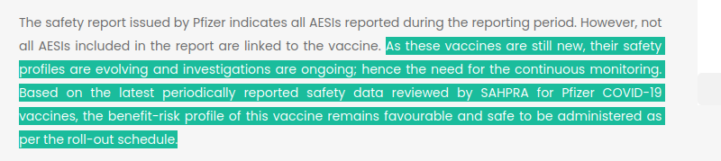

# SAPHRA

### From Transformative Health Justice

SAHPRA rejects human rights in their reply to South African doctors about C19 injections 

Ignoring what our courageous medical professionals are saying means: 

1. We do NOT have a pharmacovigilance system in South Africa 
2. SAHPRA lacks both skills and capacity to make sure we are safe 
3. SAHPRA is not loyal to the public. They answer to Big Funders, with gross conflicts of interest on C19 injections and other products

## CALL TO ACTION 

Email SAHPRA’s public faces and insist that they meet with representatives of now 100+ doctors about these risky C19 shots. 

to:Boitumelo.Semete@SAHPRA.org.za, Helen.Rees@SAHPRA.org.za 
CC: Info@THJ-Africa.org.za, theredlist.co.za

Dear SAPHRA

Subject: SAHPRA — Do The Right Thing: 

What is going on over there? SAHPRA is an entity of the National Department of Health, created by the South African Government to ensure the health and well-being of humans and animals. Or at least that's what your [website](https://www.sahpra.org.za/who-we-are/) says.

PLease could SAHPRA clarify the risks and benefits of the Pfizer Comirnaty vaccine. There is much confusion. 

