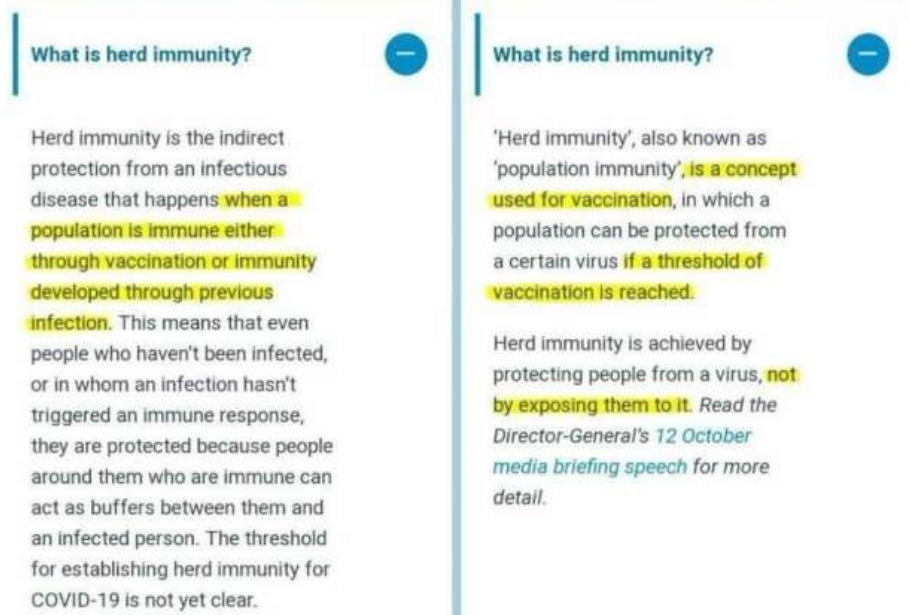
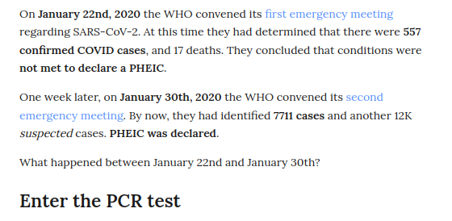
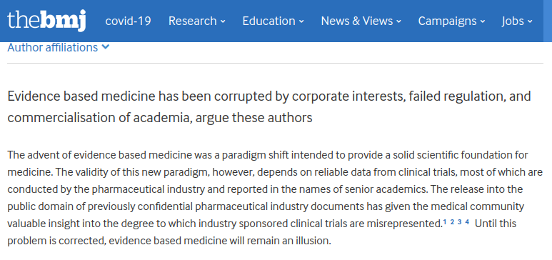

  

    <h1 class="display-4">Evidence Locker</h1>
    
Nothing but the sauce! 

    
 Any compelling documents, links and sources will be posted here and crosslinked with the articles for easy access. Currently under heavy construction.

  

## The Unmasked Truth

The health experts are divided. Some caring few are aware of the complexity and potential harms that could result from prolonged or inapproppiate mask use.

Others, who all appear to benefit greatly from the same sources of funding,   insist on mandating against all logic and reason. The recent dowgrading of early childhood development milestones are a testament to the damage that these badly considered policies continue to inflict on the most vulnerable.

### Partial List Of Studies relating to masks

This study from 2015 suggests there is three times the risk of contracting influenza-like illness if a cloth mask is used.

  
A cluster randomised trial of cloth masks compared with medical masks in healthcare workers

  
The conclusions from this Vietmanese study(2015): 
 Moisture retention, reuse of cloth masks and poor filtration may result in increased risk of infection. Cloth masks should not be recommended for HCWs, particularly in high-risk situations, and guidelines need to be updated.

  

  <a href="https://www.ncbi.nlm.nih.gov/pmc/articles/PMC4420971/" class="btn btn-info" role="button">www.ncbi.nlm.nih.gov/pmc/articles/PMC4420971/</a>

There is a lot of evidence to suggest that there are many psychological and physiological factors that have been under represented in the corporate media. 

  
Effectiveness of Adding a Mask Recommendation 

  
The conclusions: 
 The data were compatible with lesser degrees of self-protection. 

  

  <a href="https://pubmed.ncbi.nlm.nih.gov/33205991/" class="btn btn-info" role="button">www.ncbi.nlm.nih.gov/pmc/articles/PMC4420971/</a>

a brief list that we will get round to sorting out eventually

<a href="https://principia-scientific.com/forty-five-years-of-mask-studies-prove-theyre-worthless/" class="btn btn-info" role="button">forty-five-years-of-mask-studies-prove-theyre-worthless</a>
<a href="https://www.aier.org/article/the-dangers-of-masks/" class="btn btn-info" role="button">The dangers of masks from AIER</a>

https://bmjopen.bmj.com/content/5/4/e006577.full
https://www.cidrap.umn.edu/news-perspective/2020/04/data-do-not-back-cloth-masks-limit-covid-19-experts-say
 

Rational use of face masks in the COVID-19 pandemic
https://www.thelancet.com/article/S2213-2600(20)30134-X/fulltext
 
Cloth masks can increase infection:
https://www.who.int/publications/i/item/advice-on-the-use-of-masks-in-the-community-during-home-care-and-in-healthcare-settings-in-the-context-of-the-novel-coronavirus-(2019-ncov)-outbreak

**From the WHO: There is limited evidence that wearing a medical mask by healthy individuals in the households or among contacts of a sick patient, or among attendees of mass gatherings may be beneficial as a preventive measure.14-23 However, there is currently no evidence that wearing a mask (whether medical or other types) by healthy persons in the wider community setting, including universal community masking, can prevent them from infection with respiratory viruses, including COVID-19.**

 

## The Vaccines Are Not A Vaccine

Yep. Well, not unless you change the definition of a vaccine.

## The Treatment Is Still In Trial

see for yourself

or follow the links from the fact checkers themselves.
[bonus](/blacklist/media/#extra-bonus)

## The Treatment is not safe or effective

YEp.
long list

This page still under developement. 
Thanks for your patience. 

## Signals Of Harm

baseline: to be done

### Vigibase
 
Vigibase is 

### VAERS

to be done

###SAVAERS

to be done

## Emergency Use Authorisation

You can see from the waiver request that Pfizer believes that the existing reporting methods are sufficiently robust to ensure optimal pharmacovigilance and safe dispensing.

Where is the South African pharmacovigilance reporting system? The only one we can find is [SAVAERS](https://savaers.co.za/). 

The South African Health Products Regulatory Authority(SAHPRA) is mandated to ensure the

- safety
- efficacy
- quality

of all *health products*. Yet they are unable to produce any studies that should be readily available if they were doing thier job. Apparently they are  trusting pfizer, the makers of the experimental drug. Or the WHO, or even the FDA. 

It might be useful to think of pfizer as a complex financial instrument. A many headed beast, a gorgon of greed, 10 000 different corporate entities tied up in a gordian knot of legal mysteries, rather than a companhy that has any particlar individuals welfare at heart. The manual suggest swords are required to cut through knots like this.

[more about SAPHRA](questions/#sahpra) 

## Changing language definitions

This is another big subject. 

## Ivermectin 

Ivermectin is safe and can be used on a wide scale, says the [WHO](https://archive.is/FizVA). It has single-handedly transformed the lives of millions of people suffering from onchocerciasis since its introduction in 1987.

It has also been shown to be effective against other diseases. Dr Tess Lawrie from the WCH recently exposed how this evidence has been suppressed.

You can learn more by clicking on the image below.  

## Informed Consent

Question. [How can there be informed consent without information?](/blacklist/saphra/#informed-consent)

## Problems with testing

## The Illusion Of Evidence Based Medicine

[from the british medical journal](https://www.bmj.com/content/376/bmj.o702)

## Discussions about data

#### substacks

boriquagato
[Can we believe the CDC never thought of this. Read The Cat's analysis](https://boriquagato.substack.com/p/cdc-reports-of-historical-covid-deaths)

coquindechien
[legal calculus of a death lottery](https://coquindechien.substack.com/p/the-legal-calculus-of-a-death-lottery)

#### from panda

[covid reporting](https://www.pandata.org/covid-19-deaths-underreported-or-overestimated/)

##

 

