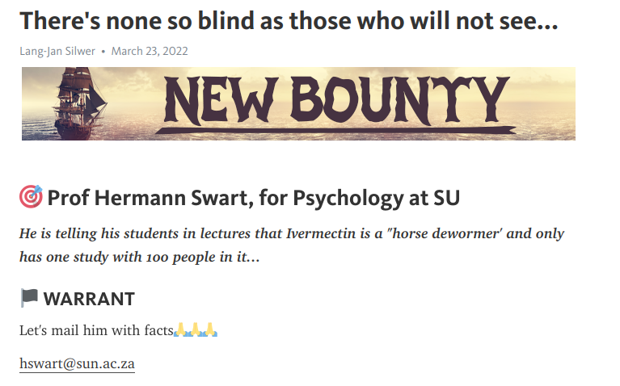

  

    <h1 class="display-4 text-center">An Open Invitation</h1>
    
To All Those Who Would Like To Know More

    
We also have questions.

    
The current ruling class seem to be struggling with the demands of a rapidly changing world. We'd like to help. In the interest of transparency we thought we might pose some questions to our public officials.

    

## A Gallery Of Questions

  
        

        <h4 class="card-title">SAHPRA</h4>
         
Are they keeping us safe from unscrupulous salesmen? The evidence would suggest not. Watch this space!

        <a href="/questions/sahpra" class="btn btn-info">Regulatory Questions</a>
         

 

 

  
        

        <h4 class="card-title">Media Monitoring Africa</h4> 
        
These information brokers are well sponsored but are they honest?

        <a href="/questions/media" class="btn btn-info">Media Questions</a>
         

 

---

## In Todays News

###### From the daily maverick [dm](https://archive.is/tb3iP)

This article by Marc Mendelson, Shabir A Madhi, Jeremy Nel, Glenda Gray, Regina Osih and Francois Venter correctly points out that the government regulations are ill conceived but there are no less than four members of the ministerial advisory committee in this list of authors. Are they relying on some kind of collective amnesia? 

We have questions for all of these scientists.  Are they trying to distance themselves from the catastrophic consequences while at the same time urging us to keep on the same disastrous path.

In the early lines they say we have 
    
<q> high levels of immunity. greater than 80% after the fourth wave
</q>

but a litte later they suggest that the primary focus should be ..

    "... on enhancing population
    immunity through vaccination 
    to prevent severe disease and death 
    from Covid-19. "

Why is vaccination neccessary if there is >80 % immunity? It is no longer a secret that the "vaccination" does not prevent severe disease and death. I suggest to the authors that this may be one of the reasons that people are more than hesitant to take thier chances with what has now become known colloquialy as the clot shot. Marc Mendelson might call it thrombo-bollocks. A more serious issue is the trust in health workers has been shattered. 

Possibly because they still repeat the false mantra that there is **only one solution**. 

     "Yet, apart from the other problems with 
     isolation and quarantine above, the only 
     current “prophylaxis” for Covid-19 is vaccination. "

What about the natural immunity that you mentioned earlier? 

Whether this experimental treatment is ,or is not, currently mandatory in SA is academic to the many who have lost their jobs or been coerced into taking a useless, unneccessary and quite possibly harmful shot in the arm.  

Later in the article they mention the "wastewater surveillance for SARS-CoV-2, which is a very useful predictor of community transmission levels". This wastewater surveillance dashboard has been maxed out for months. We surmise because the testing is so lucrative. 

Most of south africa would agree with your final paragraph. 

Maybe you could spend some of the large amounts of public money that have gone to the 'vaccination' project on some other health care requirements, and please advise the education department to take the masks off our children.

The authors might be considered the most senior of the health service senior managerial services, and we should look to them for accountability too.  

---

## Yesterdays News

### Question of the day goes to Mr Swart.

We heard about this through this telegraph. We were not at this particular lecture so we cannot verify. It is however, highly probable that he is unqualified to have an opinion, especially if he subscribes to magazines like psychology today. 

Psychologists are not worth questioning. They do not know anything. They only respond with questions. And they are never the right questions.

You can [read more about ivermectin](evidence/#ivermectin) here.

### Runners up award to 

Tanya Farber: journalist.
Talia Greyling: Expert - University of Johannesburg
Stephanie Rossouw, Expert - formerly of North West University, now supposedly seeking funding further south . 

These are academics who have completed a study based on tweets. Hmmm. Are they aware that twitter is a manipulated platform. Now that would be an interesting field of study. Or how two different people might see completely different news about an event depending on the way they consume media. When did academic researchers get so dumbed down? 

###### A few questions for Tanya Farber.

1. What do the following sources you mention in the article above have in common?

     + [Shabir Madhi - vaccinologist, Ministerial adviser](blacklist/#mac)
     + Wolfgang Preizer
     + [Stavros Nicolau](blacklist/#b4sa)

2. Do you feel you have fairly represented both sides of the story?

