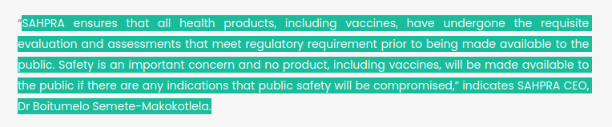

## Dear Sir/Madam

## To SAPHRA 

to:Boitumelo.Semete@SAHPRA.org.za, Helen.Rees@SAHPRA.org.za 
CC: info@THJ-Africa.org.za

from: thecarronade

Subject: SAHPRA — Do The Right Thing: Noity Boity!

Dear Noity Boity, Helen Ree s, and the rest of the public functionaries at SAPHRA.  

** What is going on over there? **

SAHPRA is an entity of the National Department of Health, created by the South African Government to ensure the health and well-being of humans and animals. 

Or at least that's what your [website](https://www.sahpra.org.za/who-we-are/) says, where we were unfortunate enough to discover this infographic that defies adjectives or expletives. 

PLease could SAHPRA clarify the risks and benefits of the Pfizer Comirnaty vaccine for us,  the foolish and ignorant public, in an open and transparent way. We grow weary of approaching the courts. 

There is much confusion and little trust. The much-marketed claim is that the novel mRNA treatment is safe and effective. SAPHRA has been mandated to validate the claims that this treatment is safe and effective.   

We refer to your recent press release above, which raises the following questions.

**Questions**

1. Why are you ignoring the signals from the [Uppsala Monitoring Centre](https://who-umc.org/) program.

2. Why are you [ignoring the signals](/evidence/#emergency-use-authorisation) from [VAERS](https://vaers.hhs.gov/)

3. What number of deaths or serious injuries would you consider acceptable before you halted the vaccine roll out?

4. Why can you not provide any evidence of the safety studies that you claim to have done in service of the South African people?

5. Why do none of you know that [Ivermectin](/evidence/#ivermectin) has been used to treat millions of people? And why do you keep suppressing alternate treatments?

6. What effect do you think the climate of fear and confusion has on the human psyche and public trust in our regulatory bodies. 

7. Do you represent the South African people or do you work for an unelected committee of special interests? 
 

There can be no informed consent without information.

Please find attached a cease and desist letter from the World Council For Health.  

We look forward to hearing your response.

Patient Regards
The Carronade Team

    

