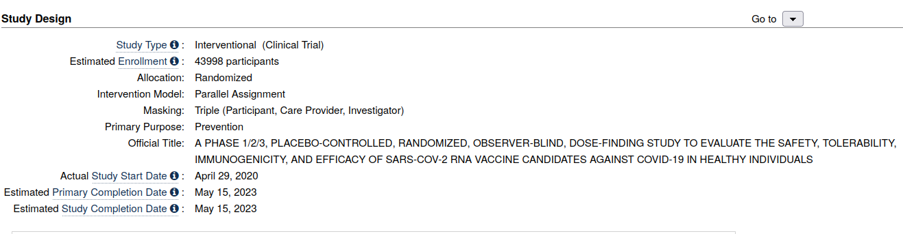

## Fact Checkers and Media

in progess ...

411.org
media monitoring africa - william bird
nathan geffen at ground up
marc mendelson at twitter

## Ground UP

###### Nathan Geffen and Ground Up 
The war on truth goes on and on and on...

How does teflon data guru Nathan Geffen get away with it? The errors of his fear mongering approach have been harshly exposed by the steady march of time, where reality on the ground has proved that at least the disaster management regulations he supported are aptly named. 

Observe his recent attack on [Free The children](https://free-the-children-now.org/). Their Aims hardly appear sinister.  

The curious reader might observe that Nathan  brushed these concerns aside at the time but they are becoming increasingly hard to ignore. 

- **malnutrition**
- **starvation**
- **lack of medical care for other sicknesses and treatable conditions**
- **ensure all children are protected (section 28 bill of rights)**

Where is Nathan Geffen's modeling of the lifetime cost to a child from malnutrition? Perhaps , like Free the Chidren, Geffen might also take inspiration from the words of others. 

###### Compare and contrast

 

His latest dishonest diatribe is so strangled it deserves a tabular response. 

### What Nathan Said

| What Groundup Said | Reality | My Question |
|---|---|---|
| anti-vaxxer organisation | refer to screenshot below and website here | why the false framing? |
| trying to deny parents the right | trying to protect parents and childrens rights | Why the inversion? |
| little credibility among their medical peers | possibly amongst your paid peers but this is laudable in context | Why no public debate? why the ad hominem? |
| pseudoscientific views on covid | ad hominem 2 and false - science is questioning | why the suppression of alternate ways of seeing and interpreting the world? |
| anger among health experts | there is public anger at health professional who are refusing to treat people | Are the health experts aware of the importance of public trust? Are they also aware of the huge numbers of people who are simply declining medical treatment? |
| blatant attempt to undermine  | it's a public legal case. | is this not misleading, demagogic and inflammatory language? |
| freedom of choice | ironic inversion 2. | The freedom to say no? | 
| extremely sinister bunch | inversion 3 and libelous projection | please could you speak about the influence that your funders or handlers exert over you. |
|not clear whether Free-the-Children...has standing | Free-the-children has the backing of thousands of parents. Other backers include the Caring Health workers coalition, the ACDP, the WCH, the redlist Movement, Vuka Za and more. The omission is revealing. | Do journalistic ethics suggest that these highly visible supporters and co-applicants deserve a mention. |
| raised by section 27 | sinister outside influence through financial incentives? | Could you explain and explore the links between the funding organisations that are pushing this dangerous and divisive message. | 

## Extra Bonus. 

For a brief two click example of just how egregious the misrepresentation from Geffen is please consider this article from [ground up][2] which references this study from the [New England Journal of Medicine][3] which in turn references this [trial][4]. 

It takes two clicks to find the trial documentation that clearly states the phase 3 trial ends in 2023. The careful reader might notice again that the entire article is written as if the trial has already concuded with a perfect safety record. That's right. 100 percent. 

Almost five months have passed so it would be interesting to put this prediction to the test of time too. What do the latest figures show? And have these being corrected yet? 

If this is true, what could possibly explain why the public perception is so different. Propaganda perhaps?

[1]:https://www.sciencedirect.com/topics/pharmacology-toxicology-and-pharmaceutical-science/pegylation
[2]: https://www.groundup.org.za/article/anti-vaxxers-are-making-false-claim-about-first-vaccine-dose-we-debunk-it-here/
[3]: https://www.nejm.org/doi/full/10.1056/NEJMoa2110345
[4]: https://clinicaltrials.gov/ct2/show/study/NCT04368728

## Bhekisisa
Mia Malan and Aysha Madhi:

1. Not a question but an observation from your earlier webinar
on medical harms. The question was asked of francois venter 
about the similarity between covid and aids. I see denial of 
medicine as similar. Could you explain why Bhekisisa has 
ignored the enviable safety record of ivermectin. 
Is it because the Emergency Use Authorisation can only be
maintained if there is no alternate treatment? 

2. Regarding the latest article in the bhekisisa. pfizer palpitations - please can you explain what you mean by mild myocarditis. This article from [Circulation][circ] suggests the immediate cessation .  

[circ]:https://www.ahajournals.org/doi/10.1161/circ.144.suppl_1.10712

