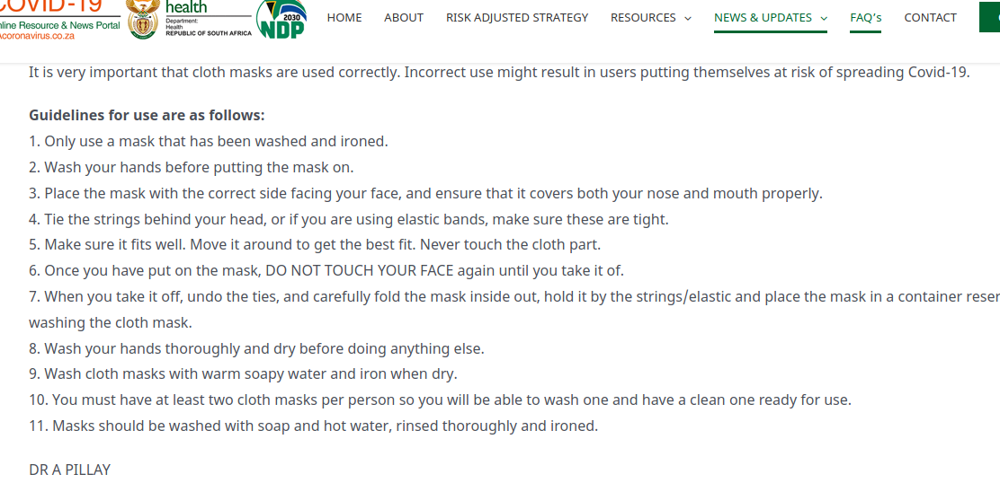

## To Mask or Not To Mask

### What Does The Science Say?

Some while ago I came across this video from the bhekisisa on [locals online](https://www.localsonline.co.za/wear-a-mask-2020/)

<embed src="https://player.vimeo.com/video/442283745"></embed>

Somebody started a conversation about the video...

.... and the poster responded with the following.

link [1](https://sacoronavirus.co.za/2020/04/21/use-of-cloth-face-masks-by-members-of-the-general-public-in-south-africa-during-the-covid-19-pandemic/)[2](https://sacoronavirus.co.za/2020/07/12/maskisamust-newnormal-how-does-a-mask-protect-you-and-others/)[3](https://www.hopkinsmedicine.org/health/conditions-and-diseases/coronavirus/coronavirus-face-masks-what-you-need-to-know) above.

.... but they did n't really take it any further. I noticed the movie stopped and rewound. What happens next in the first scene? Is the free human taken down by the mob or the police? Are there other harms that may result as a consequence of this new behaviour?
Do we want to lose theatre and song? 

what does the science say? I had a look at the sources offered and I am not impressed.

The first source is a SA government press release. We are told explicitly not to use surgical masks. They acknowledge "much debate", but reference no science, and stress the complexity of using a face mask correctly.

 

The second source is again the government: just a 23 second video. Here I would refer to Dr's Fauci and Redfield, who have stated publicly that no pandemic in history has been driven by asymptomatic transmission, and that healthy people should not be wearing masks. TO BE DONE - insert links.
The third source is john hopkins, and its mostly a fluff piece  in a similar vein, and also provides no links to any actual science.  

All of the quoted sources stress the lack of evidence and that incorrect use may be harmful.
I did a bit of digging myself and found this [paper](https://www.ncbi.nlm.nih.gov/pmc/articles/PMC7518963/) where they say:

	There is no direct evidence in humans available (National Academies of Sciences Engineering and Medicine, 2020, World Health Organization (WHO), 2020) 
	for the recommendation of cloth face mask use. 
	Based on the very low-level evidence from laboratory studies and the precautionary principle, 
	we recommend 
	cloth face mask use in community settings only if medical face masks are unavailable. 
	Additionally, high compliance and adherence to the recommendations by the general population 
	are necessary for the maximal effectiveness of interventions to prevent transmission of respiratory infections in community settings.

Also this from [science direct](https://www.sciencedirect.com/science/article/pii/S2468042720300117?via%3Dihub)

	In summary, the benefit to routine face mask use by the general public during the COVID-19 pandemic
	remains uncertain, but our initial mathematical modeling work suggests a possible strong potential benefit to near universal adoption of even weakly effective homemade masks that may synergize with, not replace, 
	other control and mitigation measures.

There is similar stuff from the Royal Society- [A modelling framework to assess the likely effectiveness of facemasks in combination with ‘lock-down’ in managing the COVID-19 pandemic](https://royalsocietypublishing.org/doi/10.1098/rspa.2020.0376), but again they stress the uncertainty and you might notice that there is no hard data. It is all "modelling" and they have generated sample data with parameters to fit their viewpoint. The code for models 1 and 2 is available at github [here](https://github.com/camepidem/COVID-19_PRSA)/

Some of the common phrasing and the misuse of the precautionary principle caught my eye and after a bit of further digging I found this gem 

    In conclusion, in the face of a pandemic the search for perfect
    evidence may be the enemy of good policy. 
    As with parachutes for jumping out of aeroplanes,
    it is time to act without waiting for randomised controlled trial evidence.

from  Trisha Greenhalgh and her colleagues at the [British Medical Journal](https://www.bmj.com/content/bmj/369/bmj.m1435.full.pdf). 

where after a rapid search they found the following studies. 

- A 2011 Cochrane review covering physical interventions and including 67 studies (many of poor quality), in which the main relevant study was a 2009 trial that showed a benefit of masks over no masks, but no benefit of respirator masks over standard ones, and also showed that masks were worn less than 50% of the time 

- A 2010 systematic review of face masks in influenza epidemics, which included standard surgical masks and respirator masks and found some efficacy of masks if worn by those with respiratory symptoms but not if worn by asymptomatic individuals.

- A 2007 systematic review and expert panel deliberation,which acknowledged the difficulties in interpreting evidence and stated: “With the exception of some evidence from SARS, we did not find any published data that directly support the use of masks ... by the public.

- Xiao and colleagues identified 10 randomised controlled trials published between 1946 and 2018 that tested the efficacy of face masks (including standard surgical masks and commercially produced paper face masks designed for the public) for preventing laboratory confirmed influenza.  None showed a significant reduction in laboratory confirmed influenza in the face mask arm. The authors concluded: “randomized controlled trials of[face masks] did not support a substantial effect on transmission of laboratory-confirmed influenza.

- A preprint of a systematic review published on 6 April 2020 examined whether wearing a face mask or other barrier (goggles,shield, veil) prevents transmission of respiratory illness such as coronavirus, rhinovirus, tuberculosis, or influenza. It identified 31 eligible studies, including 12 randomised controlled trials.The authors found that overall, mask wearing both in general and by infected members within households seemed to produce small but statistically non-significant reductions in infection rates. The authors concluded that “The evidence is not sufficiently strong to support the widespread use of face masks as a protective measure against covid-19” and recommended further high quality randomised controlled trials.

They conclude by stating that None of the studies mentioned above tested the makeshift cloth masks that CDC has recommended. To our knowledge, there are no trials of cloth masks in the general public. 

I don't know why they could nt find the [vietnamese study](https://www.ncbi.nlm.nih.gov/pmc/articles/PMC4420971/)
which found that 

    	The rates of all infection outcomes were highest in the cloth mask arm.
    	Cloth masks also had significantly higher rates of 
    	flu-like symptoms compared with the control arm.

They also offer the following arguments against masks. 

 1. there is limited evidence that they are effective.
		
 2. trials have shown that people are unlikely to wear them properly or consistently,

 3. the trials cited above have also shown that wearing a mask might make people feel safe and hence disregard other important public health advice such as hand washing and social distancing.

 4. public should not wear them since health careworkers need them more, and public buying could lead to major supply chain problems

 
 more sources

   - https://www.ncbi.nlm.nih.gov/pmc/articles/PMC7518963/

### More evidence of harm

There has been more evidence emerging of other potential harms

  - [study on long term mask use finds cancer](https://www.newstarget.com/2021-01-15-long-term-mask-use-breeds-microbes-lung-cancer.html)
  - [Italy says no to masks for children](https://www.thelibertybeacon.com/italy-masks-forbidden-at-school-judgement-of-the-council-of-state/)
  - [WHO says no need to wear a mask](https://rainbowwarrior2005.wordpress.com/2021/01/26/who-now-saying-you-do-not-need-to-wear-a-mask/)
  - [masks and harms to children](https://www.greenmedinfo.com/blog/mask-harms-kids-68-parents-report-alarming-problems-first-its-kind-study-preprint1)
  - [Do face masks work?](https://www.greenmedinfo.com/blog/mask-harms-kids-68-parents-report-alarming-problems-first-its-kind-study-preprint1)

### Another perspective from a Doctor

A Facebook friend asked me to help him respond to people that use the classic fallacious argument, "Well, if masks don't work, then why do surgeons wear them?"

I'm a surgeon that has performed over 10,000 surgical procedures wearing a surgical mask. However, that fact alone doesn't really qualify me as an expert on the matter. More importantly, I am a former editor of a medical journal. I know how to read the medical literature, distinguish good science from bad, and fact from fiction. Believe me, the medical literature is filled with bad fiction masquerading as medical science. It is very easy to be deceived by bad science.

Since the beginning of the pandemic I've read hundreds of studies on the science of medical masks. Based on extensive review and analysis, there is no question in my mind that healthy people should not be wearing surgical or cloth masks. Nor should we be recommending universal masking of all members of the population. That recommendation is not supported by the highest level scientific evidence.

First, let's be clear. The premise that surgeons wearing masks serves as evidence that "masks must work to prevent viral transmission" is a logical fallacy that I would classify as an argument of false equivalence, or comparing "apples to oranges."

Although surgeons do wear masks to prevent their respiratory droplets from contaminating the surgical field and the exposed internal tissues of our surgical patients, that is about as far as the analogy extends. Obviously, surgeons cannot "socially distance" from their surgical patients (unless we use robotic surgical devices, in which case, I would definitely not wear a mask).

The CoVID-29 pandemic is about viral transmission. Surgical and cloth masks do nothing to prevent viral transmission. We should all realize by now that face masks have never been shown to prevent or protect against viral transmission. Which is exactly why they have never been recommended for use during the seasonal flu outbreak, epidemics, or previous pandemics.

The failure of the scientific literature to support medical masks for influenza and all other viruses, is also why Fauci, the US Surgeon General, the CDC, WHO, and pretty much every infectious disease expert on the planet stated that wearing masks won't prevent transmission of SARS CoV-2. Although the public health "authorities" flipped, flopped, and later changed their recommendations, the science did not change, nor did new science appear that supported the wearing of masks in public. In fact, the most recent systemic analysis once again confirms that [masks are ineffective in preventing the transmission of viruses like CoVID-19](https://wwwnc.cdc.gov/eid/article/26/5/19-0994_article)

If a surgeon were sick, especially with a viral infection, they would not perform surgery as they know the virus would NOT be stopped by their surgical mask.

Another area of "false equivalence" has to do with the environment in which the masks are worn. The environments in which surgeons wear masks minimize the adverse effects surgical masks on their wearers.

Unlike the public wearing masks in the community, surgeons work in sterile surgical suites equipped with heavy duty air exchange systems that maintain positive pressures, exchange and filter the room air at a very high level, and increase the oxygen content of the room air. These conditions limit the negative effects of masks on the surgeon and operating room staff. And yet despite these extreme climate control conditions, clinically studies demonstrate the negative effects (lowering arterial oxygen and carbon dioxide re-breathing) of surgical masks on surgeon physiology and performance.

Surgeons and operating room personnel are well trained, experienced, and meticulous about maintaining sterility. We only wear fresh sterile masks. We don the mask in a sterile fashion. We wear the mask for short periods of time and change it out at the first signs of the excessive moisture build up that we know degrades mask effectiveness and increases their negative effects. Surgeons NEVER re-use surgical masks, nor do we ever wear cloth masks.

The public is being told to wear masks for which they have not been trained in the proper techniques. As a result, they are mishandling, frequently touching, and constantly reusing masks in a way that increase contamination and are more likely than not to increase transmission of disease.

Just go watch people at the grocery story or Walmart and tell me what you think about the effectiveness of medical masks in the community.

If you can't help but believe and trust the weak retrospective observational studies and confused public health "authorities" lying to you about the benefits and completely ignoring the risks of medical masks, then you should at least reject the illogical anti-science recommendation to block only 2 of the 3 ports of entry for viral diseases. Masks only cover the mouth and nose. They do not protect the eyes. Forget the mask!

### Whats missing

Any actual evidence.

### Where does that leave us?

I searched the medical literature, the gov pamphlets, the comments section and various social groups in search of the compelling argument to make us wear masks. I can't find it.

